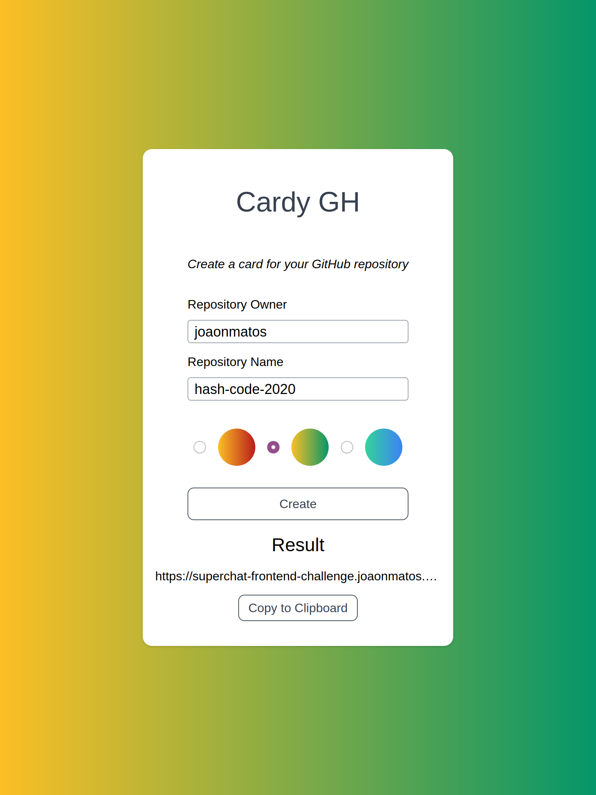
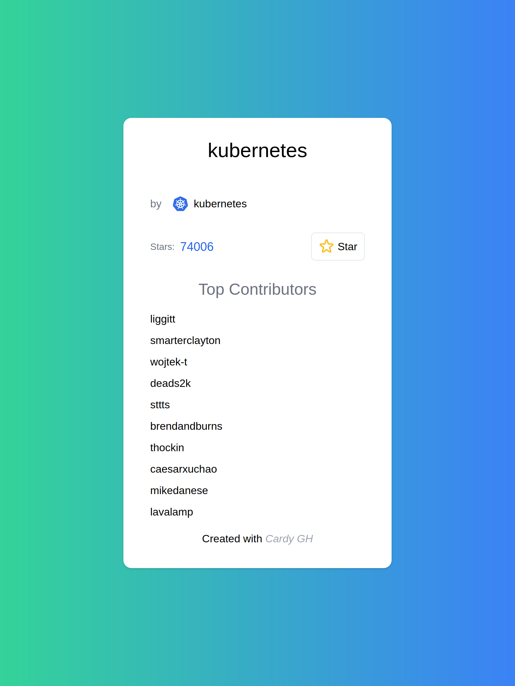

# Cardy GH

Cardy GH is a small app that generates preview cards on the fly for your
favourite GitHub repositories.

Just insert the owner's username and the repository name, and select a theme
color, and get a short link for your card, ready for you to share on your
socials.

## Some Screenshots

 * You see this page when you enter the website:

 * When you visit a card using its shortlink:

## How did you create this app?

This app is created using NextJS and TypeScript.

For the frontend, I am using TailwindCSS and CSS Modules.

For the backend, I am using PostgreSQL to store the links and Octokit to access
the GitHub API.

The app is currently hosted on Vercel and the database is hosted on Heroku.

## Why did you create this app?

I was challenged to do so by the awesome folks at
[SuperChat](https://www.superchat.de/). It was fun to get to take a bunch of
technologies I had not used, particularly on the frontend, and bang my head
against the wall to make things happen.

## How can I run it?

 1. Stand up your PostgreSQL database
 2. Use the file at /resources/db/schema.sql to set the db schema
 3. Set the DATABASE_URL environmental variable to the connection string for the
    server
 4. Build with `npm run build`
 5. Start with `npm run start`

